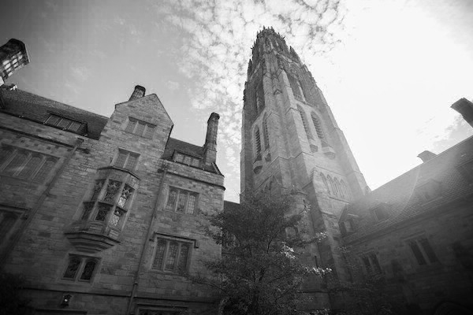

# BMP Filter Pro

**BMP Filter Pro** is a command line application developed in C that allows users to apply grayscale, blur, reflection, and edge-detecting filters to their BMP images.

## Features
The following functionality is achieved:

- [x] Users are allowed to specify their input BMP image file, the filter to apply, and the name of the resulting BMP image file.
- [x] Available filters include: grayscale, blur, reflection, and edge detection

## Usage Instructions

Filters are specified through the command line, using -r to denote reflection, -g to denote grayscale, -b to denote blur, and -e to denote edge-detection. INPUTFILE is the name of your input bmp image file name and OUTPUTFILE is the name that you want to provide to the bmp image file that will be generated with the applied filter.

To apply grayscale filter:
```
./filter -g INPUTFILE.bmp OUTPUTFILE.bmp
```
To apply blur filter:
```
./filter -b INPUTFILE.bmp OUTPUTFILE.bmp
```
To apply reflection filter:
```
./filter -r INPUTFILE.bmp OUTPUTFILE.bmp
```
To apply edge detection filter:
```
./filter -e INPUTFILE.bmp OUTPUTFILE.bmp
```

## Example

#### Original Image:


#### Grayscale Filter:



#### Blur Filter:


#### Edge Detection Filter:


#### Reflection Filter:


